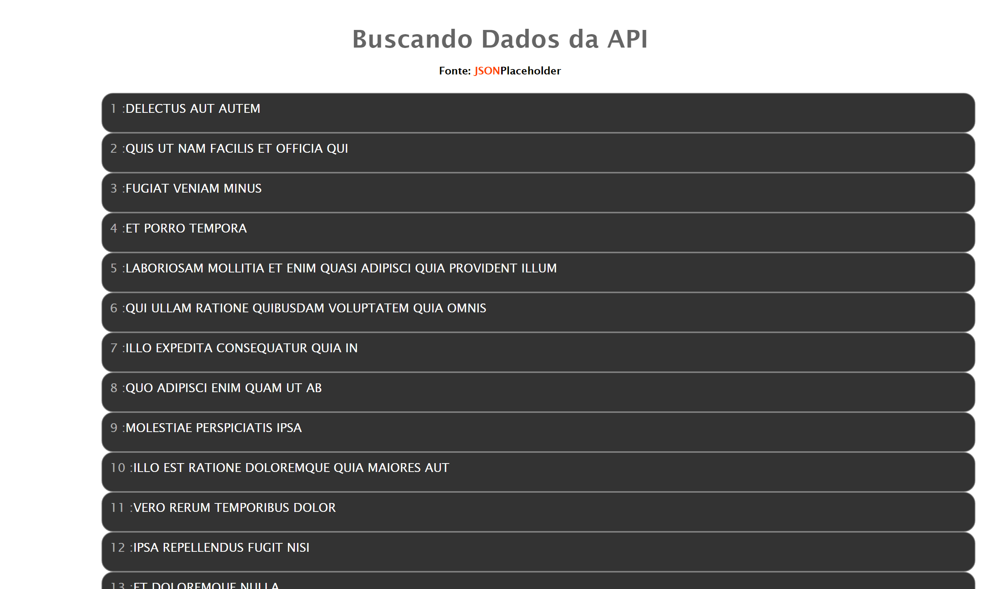
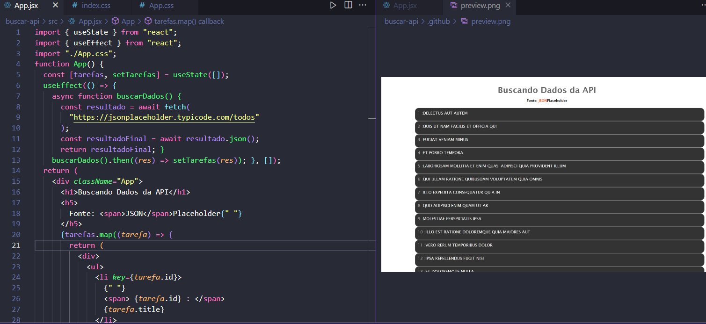

# LetsCode - ADA 
    > React basico - ADA
    > Projeto construido junto ADA

#  Tecnologias
    > HTML 
    > CSS
    > React + Vite
    > Git & GitHub
    > JavaScript

 
 
 

[Clique aqui para acessar o site Vercel](https://react-vite-api-washington.vercel.app/)

## Referência:

Professores Tops:
    - Fernando 

## Contato :
- [Dev aprendiz - Washington]

    wsgomes600@gmail.com